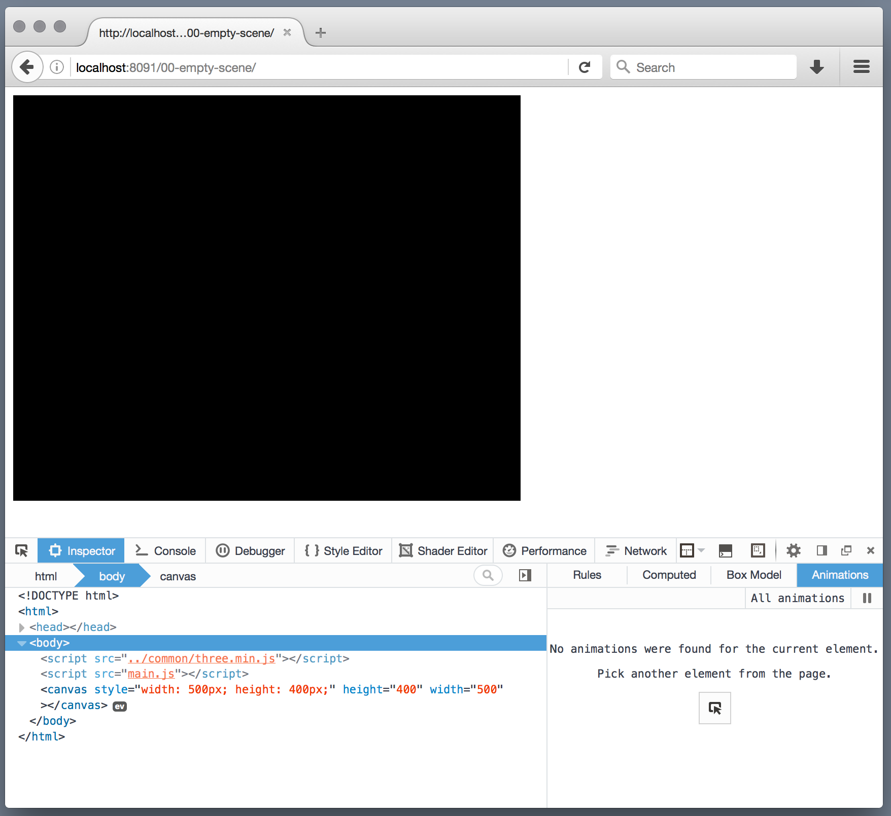

00-empty-scene
======
We will set up a basic HTML page with an empty scene using three.js. We should see a black rectangle if we set up everything correctly.

[Live demo] (https://juniorrojas.github.io/intro-3d-web/00-empty-scene)

